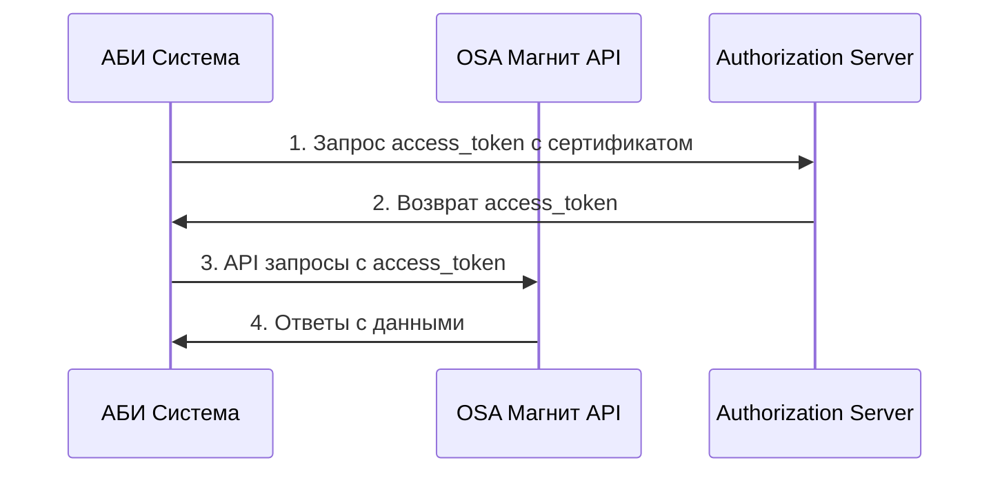

# Техническое решение: АБИ. Подключение к новому API OSA Магнит

## Обзор решения

### Цель
Реализовать переход с API OSA Магнит V1 на V2 для обеспечения стабильной работы интеграции и получения новых возможностей.

### Архитектура системы
```
┌─────────────────┐    ┌─────────────────┐    ┌─────────────────┐
│   АБИ Система   │◄──►│  OSA Магнит API │    │   Мобильный     │
│                 │    │      V2         │    │   терминал      │
└─────────────────┘    └─────────────────┘    └─────────────────┘
         │                       │                       │
         ▼                       ▼                       ▼
   Обработка сигналов      Получение/отправка      Отображение
   и данных               данных через API         данных
```

## Компоненты решения

### 1. API интеграция

#### Новый API OSA Магнит V2
- **Базовый URL**: `https://api.magnet.ru/osa/v2/`
- **Аутентификация**: OAuth 2.0 с сертификатами
- **Формат данных**: JSON
- **Версионирование**: Поддержка версии V2

#### Основные эндпоинты
```http
# Получение сигналов
GET /api/osa/v2/signals
Authorization: Bearer {access_token}

# Отправка обратной связи
POST /api/osa/v2/feedback
Content-Type: application/json
Authorization: Bearer {access_token}

# Получение проблем с товарами
GET /api/osa/v2/product-issues
Authorization: Bearer {access_token}

# Отправка графиков работы
POST /api/osa/v2/schedules
Content-Type: application/json
Authorization: Bearer {access_token}
```

### 2. Аутентификация и безопасность

#### Сертификаты
- **Тип**: X.509 сертификаты
- **Размещение**: На 2х серверах клиента
- **Проверка**: Автоматическая проверка при запуске
- **Обновление**: Ручное обновление при необходимости

#### OAuth 2.0 Flow


### 3. Обработка данных

#### Получение сигналов
```json
{
  "signals": [
    {
      "id": "signal_12345",
      "type": "merchandising",
      "store_id": "store_001",
      "product_code": "PROD_001",
      "issue_type": "placement",
      "description": "Неправильное размещение товара",
      "priority": "high",
      "created_at": "2025-09-25T10:00:00Z",
      "due_date": "2025-09-27T18:00:00Z"
    }
  ]
}
```

#### Отправка обратной связи
```json
{
  "feedback": {
    "signal_id": "signal_12345",
    "status": "completed",
    "resolution": "Проблема устранена",
    "photos": ["photo1.jpg", "photo2.jpg"],
    "completed_at": "2025-09-25T15:30:00Z",
    "merchandiser_id": "merch_001"
  }
}
```

### 4. База данных

#### Новые таблицы
```sql
-- Таблица для хранения сигналов
CREATE TABLE osa_signals_v2 (
    id NVARCHAR(50) PRIMARY KEY,
    signal_id NVARCHAR(50) NOT NULL,
    type NVARCHAR(50),
    store_id NVARCHAR(50),
    product_code NVARCHAR(50),
    issue_type NVARCHAR(100),
    description NVARCHAR(MAX),
    priority NVARCHAR(20),
    status NVARCHAR(20) DEFAULT 'pending',
    created_at DATETIME2,
    due_date DATETIME2,
    resolved_at DATETIME2,
    merchandiser_id NVARCHAR(50)
);

-- Таблица для хранения обратной связи
CREATE TABLE osa_feedback_v2 (
    id INT IDENTITY(1,1) PRIMARY KEY,
    signal_id NVARCHAR(50) NOT NULL,
    status NVARCHAR(20),
    resolution NVARCHAR(MAX),
    photos NVARCHAR(MAX),
    completed_at DATETIME2,
    merchandiser_id NVARCHAR(50),
    created_at DATETIME2 DEFAULT GETDATE()
);

-- Таблица для кодов проблем
CREATE TABLE osa_problem_codes (
    id INT IDENTITY(1,1) PRIMARY KEY,
    code NVARCHAR(50) NOT NULL,
    description NVARCHAR(MAX),
    category NVARCHAR(50),
    is_active BIT DEFAULT 1,
    created_at DATETIME2 DEFAULT GETDATE()
);
```

### 5. Мобильный терминал

#### Обновление до версии 3.6.206.5+
- **Минимальная версия**: 3.6.206.5
- **Рекомендуемая версия**: 3.6.207.1
- **Новые функции**: Поддержка V2 API, улучшенный интерфейс

#### Новые экраны
1. **Список сигналов**: Отображение сигналов от Магнит
2. **Детали сигнала**: Подробная информация о сигнале
3. **Форма обратной связи**: Отправка ответа на сигнал
4. **Фильтры**: Фильтрация по типу, приоритету, статусу

### 6. Функциональные флаги

#### Включение V2 поддержки
```json
{
  "feature_flags": {
    "osa_api_v2_enabled": true,
    "osa_signals_processing": true,
    "osa_feedback_sending": true,
    "osa_photo_upload": true,
    "osa_schedule_sending": true
  }
}
```

## Алгоритм работы

### 1. Инициализация системы
1. Загрузка сертификатов с серверов
2. Получение access_token от OSA Магнит
3. Проверка доступности API V2
4. Включение функциональных флагов

### 2. Получение сигналов
1. Периодический запрос к API (каждые 15 минут)
2. Парсинг полученных данных
3. Сохранение в локальную БД
4. Синхронизация с мобильными терминалами

### 3. Обработка в МТ
1. Отображение новых сигналов
2. Фильтрация по критериям
3. Выбор сигнала для обработки
4. Заполнение формы обратной связи

### 4. Отправка обратной связи
1. Формирование JSON ответа
2. Загрузка фотографий
3. Отправка через API V2
4. Обновление статуса в БД

## Конфигурация

### Настройки API
```json
{
  "osa_api": {
    "base_url": "https://api.magnet.ru/osa/v2/",
    "timeout": 30000,
    "retry_attempts": 3,
    "certificate_path": "/certs/magnet_client.p12",
    "certificate_password": "encrypted_password"
  }
}
```

### Настройки синхронизации
```json
{
  "sync_settings": {
    "signals_interval": 900000,
    "feedback_interval": 300000,
    "max_retries": 5,
    "batch_size": 100
  }
}
```

### Настройки уведомлений
```json
{
  "notifications": {
    "email_enabled": true,
    "smtp_server": "smtp.company.com",
    "smtp_port": 587,
    "recipients": ["admin@company.com"],
    "templates": {
      "success": "templates/success.html",
      "error": "templates/error.html"
    }
  }
}
```

## Обработка ошибок

### Типы ошибок
1. **Ошибки аутентификации**: Неверный сертификат, истекший токен
2. **Ошибки сети**: Таймауты, недоступность API
3. **Ошибки данных**: Некорректный формат, валидация
4. **Ошибки системы**: Проблемы с БД, файловой системой

### Стратегии восстановления
```csharp
public class ErrorHandler
{
    public async Task<T> ExecuteWithRetry<T>(Func<Task<T>> operation, int maxRetries = 3)
    {
        for (int i = 0; i < maxRetries; i++)
        {
            try
            {
                return await operation();
            }
            catch (AuthenticationException ex)
            {
                if (i == maxRetries - 1) throw;
                await RefreshToken();
                await Task.Delay(1000 * (i + 1));
            }
            catch (NetworkException ex)
            {
                if (i == maxRetries - 1) throw;
                await Task.Delay(5000 * (i + 1));
            }
        }
        throw new Exception("Max retries exceeded");
    }
}
```

## Мониторинг и логирование

### Метрики для отслеживания
- **Количество полученных сигналов**: В день, в час
- **Время обработки**: Среднее время от получения до ответа
- **Успешность отправки**: Процент успешных отправок
- **Ошибки API**: Количество и типы ошибок
- **Производительность**: Время отклика API

### Логирование
```csharp
public class Logger
{
    public void LogApiCall(string endpoint, HttpMethod method, int statusCode, TimeSpan duration)
    {
        var logEntry = new
        {
            Timestamp = DateTime.UtcNow,
            Endpoint = endpoint,
            Method = method.ToString(),
            StatusCode = statusCode,
            Duration = duration.TotalMilliseconds
        };
        
        _logger.LogInformation("API Call: {LogEntry}", JsonSerializer.Serialize(logEntry));
    }
}
```

## Тестирование

### Автоматические тесты
1. **Unit тесты**: Тестирование отдельных компонентов
2. **Integration тесты**: Тестирование взаимодействия с API
3. **E2E тесты**: Полный цикл от получения до отправки
4. **Performance тесты**: Нагрузочное тестирование

### Тестовые данные
```json
{
  "test_signals": [
    {
      "id": "test_signal_001",
      "type": "merchandising",
      "store_id": "test_store_001",
      "product_code": "TEST_PROD_001",
      "issue_type": "placement",
      "description": "Тестовый сигнал для проверки",
      "priority": "medium"
    }
  ]
}
```

## Развертывание

### Требования к окружению
- **.NET Framework**: 4.7.2 или выше
- **SQL Server**: 2016 или выше
- **Сертификаты**: X.509 сертификаты для аутентификации
- **Сеть**: Доступ к API OSA Магнит

### Этапы развертывания
1. **Подготовка**: Установка сертификатов, настройка БД
2. **Обновление**: Установка новой версии системы
3. **Конфигурация**: Настройка параметров API
4. **Тестирование**: Проверка работы интеграции
5. **Запуск**: Включение функциональных флагов

## Безопасность

### Защита данных
- **Шифрование**: Все данные передаются по HTTPS
- **Сертификаты**: Двусторонняя аутентификация
- **Токены**: Временные access_token с ограниченным сроком действия
- **Логирование**: Безопасное логирование без чувствительных данных

### Аудит
- **Логи доступа**: Все обращения к API логируются
- **Мониторинг**: Отслеживание подозрительной активности
- **Резервное копирование**: Регулярное создание резервных копий

## Производительность

### Оптимизации
- **Кэширование**: Кэширование часто используемых данных
- **Пакетная обработка**: Группировка запросов для уменьшения нагрузки
- **Асинхронность**: Асинхронная обработка запросов
- **Connection pooling**: Переиспользование соединений

### Масштабирование
- **Горизонтальное**: Добавление серверов при росте нагрузки
- **Вертикальное**: Увеличение ресурсов существующих серверов
- **Балансировка**: Распределение нагрузки между серверами

## Поддержка и обслуживание

### Мониторинг в реальном времени
- **Health checks**: Проверка состояния системы
- **Alerts**: Уведомления о критических ошибках
- **Dashboards**: Визуализация метрик и состояния

### Плановое обслуживание
- **Обновление сертификатов**: Ежегодное обновление
- **Обновление API**: Слежение за изменениями в API
- **Очистка логов**: Регулярная очистка старых логов
- **Резервное копирование**: Ежедневное создание бэкапов

---
*Документ создан: 27.09.2025*  
*Версия: 1.0*  
*Статус: Готов к реализации*
